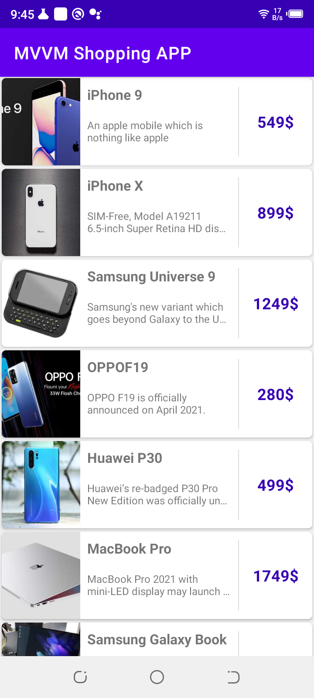
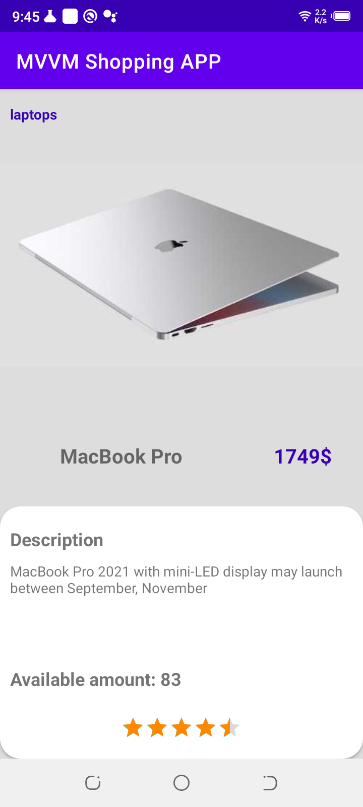

# 📱 Android MVVM App with Retrofit, RecyclerView, Coil, RxJava, Safe Args, and Navigation Component

This is a sample Android app built with Kotlin that showcases the Model-View-ViewModel (MVVM) architecture pattern using Retrofit for network requests, RecyclerView for displaying a list of data, Coil for efficient image loading, RxJava for reactive programming, Safe Args for passing parameters between fragments, and the Navigation Component for navigating between fragments.

The app retrieves data from the `products` endpoint from https://dummyjson.com and displays it in a list using a RecyclerView. The product images are loaded using the Coil library, which provides efficient image loading and caching.

## 🚀 Features

- Utilizes the MVVM architecture pattern for clear separation of concerns and maintainability
- Makes network requests using Retrofit for easy and efficient API calls
- Uses RxJava for reactive programming to handle asynchronous operations and event handling
- Displays a list of data using RecyclerView with efficient data binding and view recycling
- Efficiently loads and caches images using the Coil library
- Includes loading and error states to handle network connectivity issues
- Uses Safe Args to pass parameters between fragments
- Navigates between fragments using the Navigation Component
- Built with Kotlin and follows modern Android development best practices

## 🏁 Getting Started

To get started with the app, clone the repository and open it using Android Studio.

## 🔧 Dependencies

- Retrofit 2 for network requests
- RxJava 3 for reactive programming
- RecyclerView for displaying a list of data
- ViewModel and LiveData for handling data and state changes
- Gson for JSON parsing
- Coil for efficient image loading and caching
- Safe Args for passing parameters between fragments
- Navigation Component for navigating between fragments

## 📷 Screenshots

  
  

## 🎨 Navigation Graph

The app uses the Navigation Component to navigate between fragments. The `nav_graph.xml` file defines the app's navigation graph, which includes the following fragments:

- `ProductListFragment`: Displays a list of products retrieved from the server using Retrofit and RxJava.
- `ProductDetailFragment`: Displays details for a selected product, including the product name, image, and description. The fragment uses Safe Args to receive the product data from the `ProductListFragment`.

## 📝 License

This project is free to use and is licensed under the MIT License.
